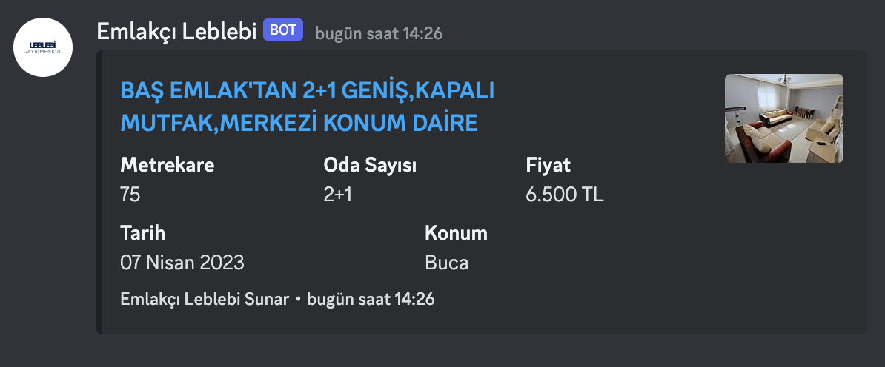

## Bilgisayarınızda Çalıştırın

Projeyi klonlayın

```bash
  git clone https://link-to-project
```

Proje dizinine gidin

```bash
  cd my-project
```

Projeyi çalıştırmak için aşağıdaki komutu çalıştırın

```bash
  make up
```

## Ortam Değişkenleri

Bu projeyi çalıştırmak için aşağıdaki ortam değişkenlerini .env dosyanıza eklemeniz gerekecek

`FLARESOLVERR_URL`

`USER_AGENT`

`CATEGORY_URL`

`DISCORD_TOKEN`

`DISCORD_CHANNEL_ID`

## Ekran Görüntüleri


